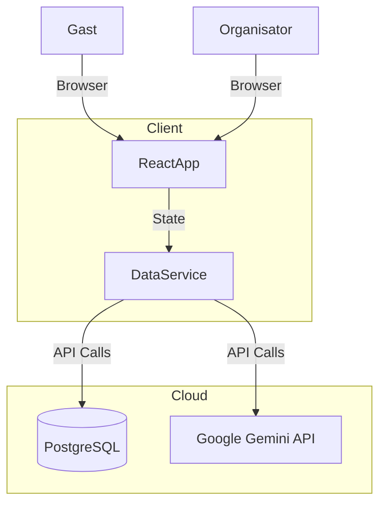

# Architektur Dokumentation

## Aktuelle Architektur (Prototyp)

Die Anwendung ist derzeit als reine **Single Page Application (SPA)** konzipiert, die ohne dediziertes Backend läuft.

- **State Management:** React `useState` und `useEffect`.
- **Persistenz:** Der `DataService` (`src/services/dataService.ts`) fungiert als Abstraktionsschicht, speichert aber physisch alles im `localStorage` des Browsers.
- **Routing:** Hash-basiertes Routing (`/#/admin`, `/#/p/id`), um ohne Server-Konfiguration auf statischen Hosts zu funktionieren.

### Grenzen der aktuellen Architektur

- Daten sind nicht synchronisiert zwischen Nutzern (Admin sieht nicht, was Gast einträgt).
- Keine echte Sicherheit bei Login oder Datenzugriff.

---

## Ziel-Architektur (Production Ready)

Für den Live-Betrieb wird die Architektur auf **Supabase** umgestellt.

### 1. Backend: Supabase

Supabase ersetzt den `localStorage` und bietet:

- **PostgreSQL Datenbank:** Für persistente, zentrale Datenspeicherung.
- **Row Level Security (RLS):** Damit Gäste nur ihre eigenen Daten bearbeiten dürfen.
- **Edge Functions (Optional):** Für den sicheren E-Mail-Versand via Resend.

### 2. Frontend Anpassungen

- Der `DataService` muss komplett umgeschrieben werden, um `supabase-js` Calls statt `localStorage` Zugriffen zu tätigen.
- Die Interfaces in `types.ts` bleiben weitgehend gleich, was das Refactoring erleichtert.

### 3. Hosting

- **Vercel** wird empfohlen für das Hosting des React-Frontends.
- Environment Variables (Supabase URL, Anon Key) werden in Vercel hinterlegt.

## Komponenten-Diagramm

